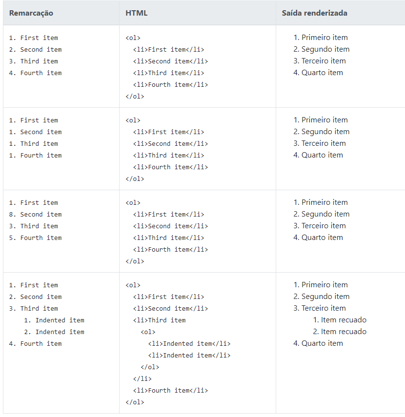
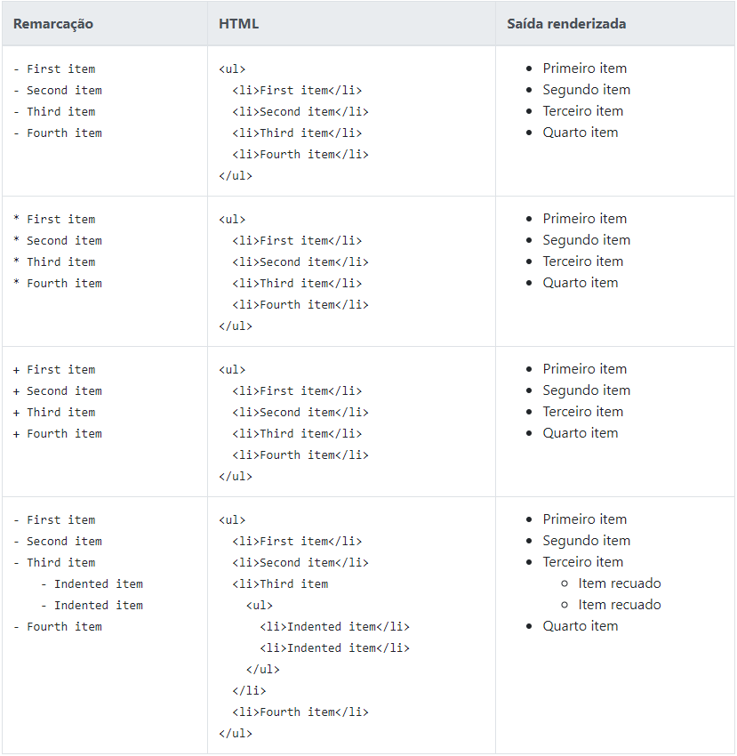
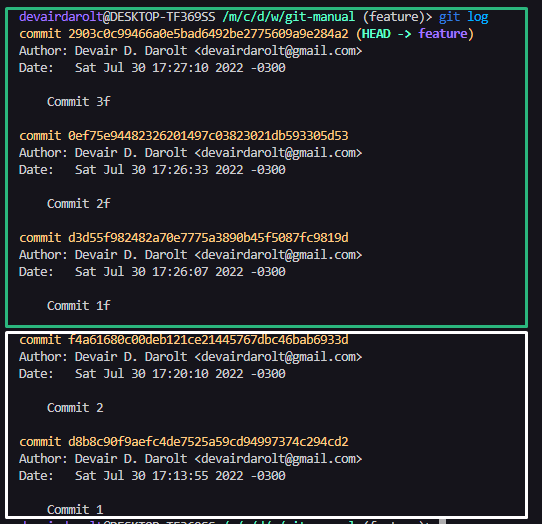
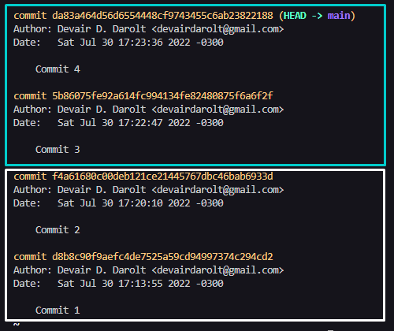
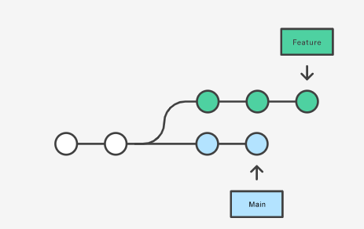
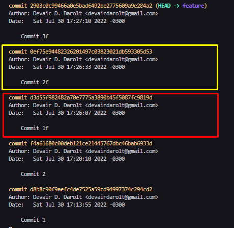
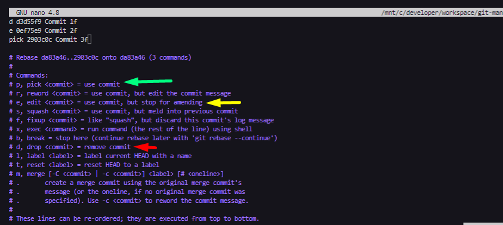
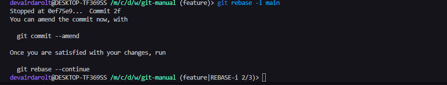
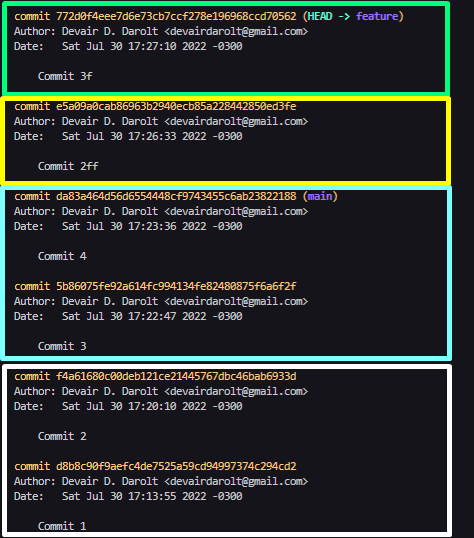

# Uma introdução ao Git e ao GitHub

<h2>Comandos úteis</h2>

<h4><b>Quando o <code>git status</code> mostrat todos os arquivos como unsteged</b></h4>

><code>git config --global core.autocrlf true</code>

><code>git config --global core.whitespace cr-at-eol</code>

Lembrar credenciais
><code>git config --global credential.helper store</code>

<h4>HTTPS to SSH</h4>

><code>git remote -v</code>

><code>git remote set-url origin git@github.com:USERNAME/REPOSITORY.git</code>

<h4>SSH to HTTPS</h4>

><code>git remote set-url origin <https://github.com/USERNAME/REPOSITORY.git></code>

<h2>Markdown</h2>
Algumas referêcias para auxiliar na escrita do README
 
 
 
<h3>Listas ordenadas</h3>
 
Para criar uma lista ordenada, adicione itens de linha com números seguidos por pontos. Os números não precisam estar em ordem numérica, mas a lista deve começar com o número um.

    

 
<h3>Listas não ordenadas</h3>
 
Para criar uma lista não ordenada, adicione traços ( -), asteriscos ( *), ou sinais de adição ( +) na frente dos itens de linha. Recue um ou mais itens para criar uma lista aninhada.

    

>**Iniciando itens de lista não ordenados com números**
>Se você precisar iniciar um item de lista não ordenado com um número seguido por um ponto, você pode usar uma barra invertida ( \\ ) para escapar do período.

   

<h2>Etapa 1. Crie o repositório</h2>

Inicialmente, o repositório que você criar no Bitbucket ficará vazio sem nenhum código nele. Tudo bem porque você começará a adicionar alguns arquivos a ele em breve. Para apontar um novo repositório local para um repositório remoto basta fazer os segintes comandos:

 
<h3><b>... Criando um repositório por linha de comando</b></h3>
 

><code>git init</code> 
><code>git add README.md</code> 
><code>git commit -m "first commit"</code> 
><code>git branch -M master</code> 
><code>git remote add origin <https://github.com/devairdarolt/repository-name.git></code> 
><code>git push -u origin master</code> 

 
<h3><b>… Enviar um repositório local para um repositório remoto</b></h3>
 

><code>git remote add origin <https://github.com/devairdarolt/devairdarolt.git></code> 
><code>git branch -M master</code> 
><code>git push -u origin master</code>

 
 
<h2>Etapa 2. Merging vs. Rebasing</h2>

<b>git merge</b> e <b>git rebase</b> são comandos oferecem formas alternativas de integrar commits de diferentes branches, e ambas as opções vêm com suas próprias vantagens.

 
<h3><b>Visão geral conceitual</b></h3>
A primeira coisa a entender sobre <b>git rebase</b> que ele resolve o mesmo problema que <b>git merge</b>. Ambos os comandos são projetados para integrar as alterações de uma ramificação em outra ramificação - eles apenas fazem isso de maneiras muito diferentes.
Considere o que acontece quando você começa a trabalhar em um novo recurso em uma ramificação dedicada e, em seguida, outro membro da equipe atualiza a <b>branch main</b> com novos commits. Isso resulta em um histórico bifurcado, que deve ser familiar para qualquer pessoa que tenha usado o Git como uma ferramenta de colaboração.

  

    

        

            
            
            

                Fig.1 - 4K Mountains Wallpaper
            

        

    

    

  
A imagem ilustra em <b style="color:#08b7f0;">azul</b> as atualizações da main, enquanto em verde os commits de atualizações de feature. Como a branch main é a branch que todos os desenvolvedores irão se basear, sempre antes de fazer um pull-request é importante  fazer um merge/rebase para garantir que a feature esta usando os códigos mais atuais da main.

 
<h3><b>Merge</b></h3>

A opção mais fácil é o **merge** da branch main para a ramificação de feature usando algo como o seguinte:
><code>git checkout feature</code> 
><code>git merge main</code> 

Ou, utilizando os dois comandos em um da seguinte forma:

><code>git merge feature main</code>

 
Isso cria um novo “commit de mesclagem” tipo <code>Merge branch 'main' into feature</code> no feature que une os históricos de ambas as ramificações, dando a você uma estrutura de ramificação parecida com esta:

 

    
    

  
Assim, a branch feature irá portar os ultimos comites em azul em sua estruturação. O Merge é bom porque é uma ação não destrutiva. As ramificações existentes não são alteradas de forma alguma. Isso evita todas as armadilhas potenciais do rebase (discutido abaixo).

Por outro lado, isso também significa que a feature branch terá um commit de merge estranho toda vez que você precisar incorporar mudanças upstream. Se main é muito ativo, isso pode poluir um pouco o histórico do seu branch de recursos. Embora seja possível mitigar esse problema com recursos avançados **git log** opções, pode dificultar a compreensão da história do projeto por outros desenvolvedores.

 
<h2>Rebase </h2>

Como alternativa ao merge, você pode usar o **rebase** da branch feature  para **branch main** usando os seguintes comandos:

><code>git checkout feature</code> 
><code>git rebase main</code> 

Isso move toda a **branch feature**  para começar na ponta do **branch main**, incorporando efetivamente todos os novos commits em main. Mas, em vez de usar um commit de mesclagem, o rebase reescreve o histórico do projeto criando novos commits para cada commit no branch original. Dessa forma todos os commits da branch feature irão desaparecer e a branch main irá conter apenas o commit que adiciona a feature.

 

    
    

 

 
O principal benefício do **rebase** é que você obtém um histórico de projeto muito mais limpo. Primeiro, ele elimina os commits de mesclagem desnecessários exigidos pelo git **merge**. Segundo, como você pode ver no diagrama acima, o **rebase** também resulta em um histórico de projeto perfeitamente linear - você pode seguir a dica de feature todo o caminho até o início do projeto sem quaisquer bifurcações.

 
<h2>Rebase Iterativo</h2>

No rebase iterativo <code>git rebase -i</code> é possive escolher diversas opções para cada commit. Supondo que na branch feature cada commit é referente a uma funcionalidade, no entanto as funcionalidades dos <code>commit 1f</code> devem ser removidas e a funcionalidade do <code>commit 2f</code> precisa ser reajustada para <code>commit 2ff</code>. Então usa-se o rebase iterativo para essa alteração.

Considerando o cenário da imagem da esquerda, iremos usar como base do rebase a main, assim todo código será desempilhado até o commit que aponta para a HEAD da main, em seguida abrirá o editor para que seja decidido o que fazer com cada commit.

><code>git rebase -i main</code>

    
    

 
 
A figura mostra as opções para cada commit individual que está na feature, sendo que o topo são os commits mais antigos e no fim os mais recentes. Alterar a ordem das linhas altera a ordem dos commits

    

 
Após salvar e fechar o arquivo, o git inicia o processo re rebase iterativo. Como o <code>Commit 2f</code> foi marcado para edição, o git ira pausar o processo nesse ponto para que a edição seja feita.

  

    

 

Fazendo a alteração do arquivo <code>commit-2f.txt</code> para <code>commit-2ff.txt</code> basta marcar para <code>staged</code> e então fazer um <code>commit ammend</code> para sobrescrever o ultimo commit, que no caso é o <code>0ef75e9 Commit 2f</code>

  

><code>mv commit-2f.txt commit-2ff.txt</code> -- Renomeia o arquivo 
><code>git add .</code> -- Marca para commit 
><code>git commit --amend -m "Commit 2ff</code> -- Sobrescreve o ultimo commit ( 2f ) 
><code>git rebase --continue</code>  -- continua para o próximo da lista do rebase iterativo 

  

O resultado desse merge ficou conforme o desejado: Em amarelo o commit alterado, em verde o commit conforme feito inicialmente, em azul os commits novos da <code>main</code> e em branco os commits que ja existiam na main quando a branch feature foi criada.

  

    

 
