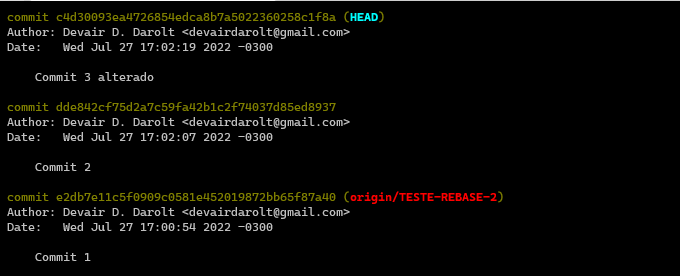
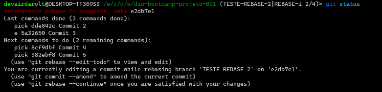
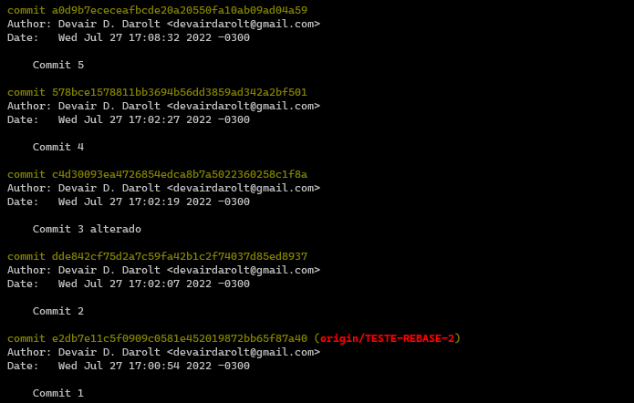

# Uma introdução ao Git e ao GitHub

<h2>Markdown</h2>
Algumas referêcias para auxiliar na escrida do README
 
 
 
<h3>Listas ordenadas</h3>
 
Para criar uma lista ordenada, adicione itens de linha com números seguidos por pontos. Os números não precisam estar em ordem numérica, mas a lista deve começar com o número um.

    

 
<h3>Listas não ordenadas</h3>
 
Para criar uma lista não ordenada, adicione traços ( -), asteriscos ( *), ou sinais de adição ( +) na frente dos itens de linha. Recue um ou mais itens para criar uma lista aninhada.

    

>**Iniciando itens de lista não ordenados com números**
>Se você precisar iniciar um item de lista não ordenado com um número seguido por um ponto, você pode usar uma barra invertida ( \\ ) para escapar do período.

   

<h2>Etapa 1. Crie o repositório</h2>

Inicialmente, o repositório que você criar no Bitbucket ficará vazio sem nenhum código nele. Tudo bem porque você começará a adicionar alguns arquivos a ele em breve. Para apontar um novo repositório local para um repositório remoto basta fazer os segintes comandos:

 
<h3><b>... Criando um repositório por linha de comando<b></h3>
 

><code><b>
>git init 
>git add README.md 
>git commit -m "first commit" 
>git branch -M master 
>git remote add origin <https://github.com/devairdarolt/repository-name.git> 
>git push -u origin master</b></code> 

 
<h3><b>… Enviar um repositório local para um repositório remoto<b></h3>
 

><code><b>
>git remote add origin <https://github.com/devairdarolt/devairdarolt.git>
>
>git branch -M master
>
>git push -u origin master</b></code>

 
 
<h2>Etapa 2. Merging vs. Rebasing</h2>

<b>git merge</b> e <b>git rebase</b> são comandos oferecem formas alternativas de integrar commits de diferentes branches, e ambas as opções vêm com suas próprias vantagens.

 
<h3><b>Visão geral conceitual</b></h3>
A primeira coisa a entender sobre <b>git rebase</b> que ele resolve o mesmo problema que <b>git merge</b>. Ambos os comandos são projetados para integrar as alterações de uma ramificação em outra ramificação - eles apenas fazem isso de maneiras muito diferentes.
Considere o que acontece quando você começa a trabalhar em um novo recurso em uma ramificação dedicada e, em seguida, outro membro da equipe atualiza a <b>branch main</b> com novos commits. Isso resulta em um histórico bifurcado, que deve ser familiar para qualquer pessoa que tenha usado o Git como uma ferramenta de colaboração.

  

    

        

            
            
        

    

    

  
A imagem ilustra em <h4 style="color:lightblue;">azul</h4> as atualizações da <h4 style="color:lightblue;">main</h4>, enquanto em <h4 style="color:lightgreen;">verde</h4> os commits de atualizações de <h4 style="color:lightgreen;">feature</h4>. Como a branch main é a branch que todos os desenvolvedores irão se basear, sempre antes de fazer um pull-request é importante  fazer um merge/rebase para garantir que a feature esta usando os códigos mais atuais da main.

 
<h3><b>Merge</b></h3>

A opção mais fácil é o **merge** da branch main para a ramificação de feature usando algo como o seguinte:
>git checkout feature
>
>git merge main

Ou, você pode condensar isso em uma linha:

>git merge feature main

Isso cria um novo “commit de mesclagem” no featurebranch que une os históricos de ambas as ramificações, dando a você uma estrutura de ramificação parecida com esta:

    

Merge é bom porque é uma ação não destrutiva. As ramificações existentes não são alteradas de forma alguma. Isso evita todas as armadilhas potenciais do rebase (discutido abaixo).

Por outro lado, isso também significa que a feature branch terá um commit de merge estranho toda vez que você precisar incorporar mudanças upstream. Se main é muito ativo, isso pode poluir um pouco o histórico do seu branch de recursos. Embora seja possível mitigar esse problema com recursos avançados **git log** opções, pode dificultar a compreensão da história do projeto por outros desenvolvedores.

<h2>Rebase </h2>

Como alternativa ao merge, você pode usar o **rebase** da branch feature  para **main branch** usando os seguintes comandos:
>git checkout feature

>git rebase main

Isso move toda a **branch feature**  para começar na ponta do **main branch**, incorporando efetivamente todos os novos commits em main. Mas, em vez de usar um commit de mesclagem, o rebase reescreve o histórico do projeto criando novos commits para cada commit no branch original. Dessa forma todos os commits da branch feature irão desaparecer e a branch main irá conter apenas o commit que adiciona a feature.

    

O principal benefício do **rebase** é que você obtém um histórico de projeto muito mais limpo. Primeiro, ele elimina os commits de mesclagem desnecessários exigidos pelo git **merge**. Segundo, como você pode ver no diagrama acima, o **rebase** também resulta em um histórico de projeto perfeitamente linear - você pode seguir a dica de feature todo o caminho até o início do projeto sem quaisquer bifurcações. Isso facilita a navegação em seu projeto com comandos como **git log**, **git bisect**, e **gitk**.

<h3>Rebase Iterativo</h3>

>Assim o log ficará da seguinte forma:

    

> Observando o status é possível ver sa próxima execução <code>pick xxxx commit 4</code> e <code>pick xxxx commit 5</code>

    

>Após finalizar a alteração é possível realizar <code>git rebase --continue</code> para prosseguir com os próximos comandos.
>
><code>git rebase -i HEAD~2</code> Abre um arquivo para editar os ultimos dois commits da branch

>Ao finalizar o log ficará da seguinte forma com o commit 3 alterado:

    

> Essa alteração foi feita apenas na mensagem do commit mas poderia ser uma correção no próprio código

<h3>Consolidando tudo em um único commit no topo da dev:</h3>
